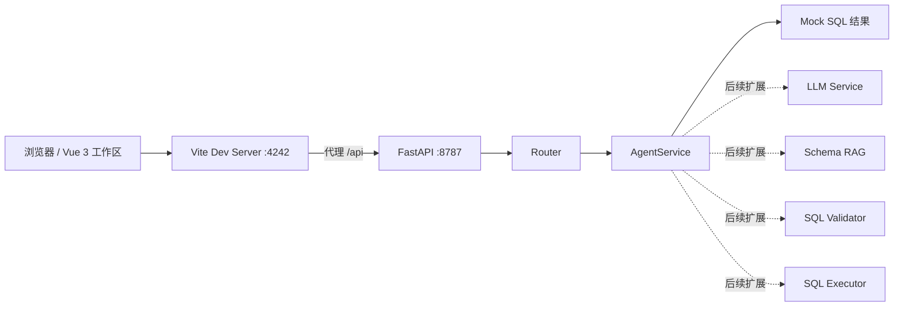

<div align="center">
  <h1>SQLAgent</h1>
  <p><strong>一个 NL2SQL项目：把业务问题直接翻译成可查看、可调整的 SQL。</strong></p>
  <p>Vue 3 工作区负责输入与结果展示，FastAPI 后端负责查询接口与后续智能链路扩展。</p>
</div>

---

## 项目概览

SQLAgent 是一个面向中文场景的 NL2SQL 原型项目。
你可以像提问一样输入业务问题，界面会在同一页内展示 SQL、状态与说明，适合做产品演示、链路验证和后续智能体能力扩展。

当前项目已经具备：

- 前后端分离的演示工作区
- `/api/query` 与 `/api/health` 两个基础接口
- 基于关键词的示例 SQL 返回逻辑
- 可继续接入 LangGraph、Schema RAG、SQL 校验与执行链路的后端分层结构

> 当前阶段仍以 mock 能力为主，适合作为真实 NL2SQL 系统的骨架，而不是最终形态。

---

## 核心体验

| 模块 | 当前能力 | 说明 |
| --- | --- | --- |
| 自然语言输入 | 已完成 | 支持直接输入中文业务问题 |
| SQL 结果展示 | 已完成 | 同页展示 SQL、状态、说明 |
| 后端查询接口 | 已完成 | FastAPI 提供 `/api/query` |
| 健康检查 | 已完成 | FastAPI 提供 `/api/health` |
| 智能生成链路 | 初始骨架 | 目录已拆分为 agent、rag、validator、services |
| 真实模型接入 | 待扩展 | 当前默认使用 mock provider |

---

## 页面与交互亮点

```text
一句自然语言问题
        │
        ▼
前端演示工作区
  - 输入问题
  - 提交请求
  - 展示 SQL / 状态 / 说明
        │
        ▼
FastAPI /api/query
        │
        ▼
AgentService
  - 当前返回示例 SQL
  - 后续可接入 LLM / RAG / 校验 / 执行
```

一个典型输入示例：

```text
找出近 90 天收入最高的 10 位客户。
```

当前示例输出风格：

```sql
SELECT *
FROM customers
WHERE created_at >= CURRENT_DATE - INTERVAL '30 days'
LIMIT 100;
```

---

## 技术栈

| 层级 | 技术 |
| --- | --- |
| 前端 | Vue 3、TypeScript、Vite |
| 后端 | FastAPI、Pydantic Settings |
| 智能体编排 | LangGraph、LangChain Core |
| 数据访问 | SQLAlchemy、aiosqlite |
| 缓存预留 | Redis |
| 测试 | pytest |
| Python 环境 | Python 3.12、uv |

---

## 架构视图



---

## 目录结构

```text
SQLAgent/
├─ frontend/
│  ├─ src/
│  │  └─ App.vue           # 演示工作区界面
│  ├─ package.json
│  └─ vite.config.ts       # 本地开发端口与 /api 代理
├─ backend/
│  ├─ app/
│  │  ├─ main.py           # FastAPI 应用入口
│  │  ├─ routers/          # API 路由
│  │  ├─ services/         # 业务服务
│  │  ├─ agent/            # 智能体编排骨架
│  │  ├─ rag/              # Schema / 检索能力预留
│  │  ├─ validator/        # SQL 校验能力预留
│  │  ├─ database/         # 数据库引擎与会话
│  │  └─ prompts/          # Prompt 与 few-shot 数据
│  ├─ dev.py               # 本地开发启动脚本
│  ├─ pyproject.toml
│  └─ .env.example
└─ README.md
```

---

## 快速开始

### 1. 启动后端

```bash
cd backend
uv sync
cp .env.example .env
uv run dev.py
```

后端默认运行在：

```text
http://127.0.0.1:8787
```

健康检查地址：

```text
http://127.0.0.1:8787/api/health
```

### 2. 启动前端

```bash
cd frontend
pnpm install
pnpm dev
```

前端默认运行在：

```text
http://localhost:4242
```

Vite 已将 `/api` 请求代理到后端 `127.0.0.1:8787`，因此前端开发时无需手动处理跨域。

---

## 当前接口

### `GET /api/health`

用于健康检查。

返回示例：

```json
{
  "status": "ok",
  "service": "nl2sql-backend"
}
```

### `POST /api/query`

根据自然语言问题生成 SQL。

请求示例：

```json
{
  "question": "找出近 90 天收入最高的 10 位客户。"
}
```

当前响应会返回：

- `sql`
- `explanation`
- `status`

---

## 当前开发状态

- [x] 前端演示页已完成
- [x] 后端基础 API 已完成
- [x] 本地联调链路已打通
- [x] 示例 SQL 生成逻辑已接入
- [x] 初级教学型 SQLAgent 链路已初始化（fallback + LangGraph + SQL 校验）
- [ ] 真实 LLM Provider 接入
- [ ] Schema RAG 检索增强
- [ ] SQL 校验与安全约束完善
- [ ] 真实数据库执行与结果回显

---

## 新手学习路线

如果你是第一次做 Agent 项目，推荐按下面这条顺序学习：

1. **Stage 1：单 Agent 最小闭环**：先跑通 mock 模式，看懂 `/api/query -> AgentService -> LangGraph -> Validator`。
2. **Stage 2：真正的 SQLAgent**：开始理解 schema、prompt、few-shot、SQL 生成质量。
3. **Stage 3：企业级能力**：重点学习 SQL 安全、真实执行、权限、审计、观测。
4. **Stage 4：多智能体演进**：等单 Agent 稳定后，再思考 planner / retriever / validator / executor 的角色拆分。
5. 最后再去阅读 `docs/BEGINNER_SQLAGENT_ROADMAP.md`，按阶段逐步推进，并完成每个 Stage 的实操作业与验收标准。

一句话概括这条路线：

> **先学会一个 Agent 怎么工作，再学 SQLAgent 怎么可靠落地，最后再学多智能体怎么协作。**

### 学习文档导航

如果你不知道先看哪份文档，可以按这个顺序：

1. [`docs/BEGINNER_SQLAGENT_ROADMAP.md`](docs/BEGINNER_SQLAGENT_ROADMAP.md)：仓库内主学习路线，适合先理解整体阶段。
2. [`docs/BEGINNER_SQLAGENT_4_WEEK_PLAN.md`](docs/BEGINNER_SQLAGENT_4_WEEK_PLAN.md)：按周推进的实操版学习计划，适合直接照着练。
3. [`docs/AGENT_LEARNING_TODO.md`](docs/AGENT_LEARNING_TODO.md)：结合外部官方路线与本仓库现状整理出的进阶 TODO，尤其适合后续补企业级与多智能体学习。

---

## 为什么这个项目适合作为骨架

这个仓库并不是把所有能力都堆在一起，而是提前拆出了清晰的扩展边界：

- `services/` 负责业务编排
- `agent/` 负责智能体流转骨架
- `rag/` 负责模式知识与检索增强
- `validator/` 负责 SQL 安全与合法性检查
- `database/` 负责连接、会话与执行能力
- `prompts/` 负责提示词与示例管理

这种分层方式更适合逐步把“演示项目”升级成“可落地系统”。

---

## 开发建议

如果你准备继续往真实 NL2SQL 方向推进，推荐按这个顺序演进：

1. 接入真实 LLM provider，替换当前 mock 输出
2. 为表结构、字段语义、业务术语建立 Schema RAG
3. 增加 SQL validator，限制危险语句与越权访问
4. 接入真实数据库执行器，返回结果与解释说明
5. 为常见问题补充 few-shot 示例与测试用例

---

## 适合的使用场景

- NL2SQL 产品原型演示
- 智能查询工作台雏形
- LLM 到 SQL 的接口验证
- RAG / LangGraph / SQL 安全链路实验

---
