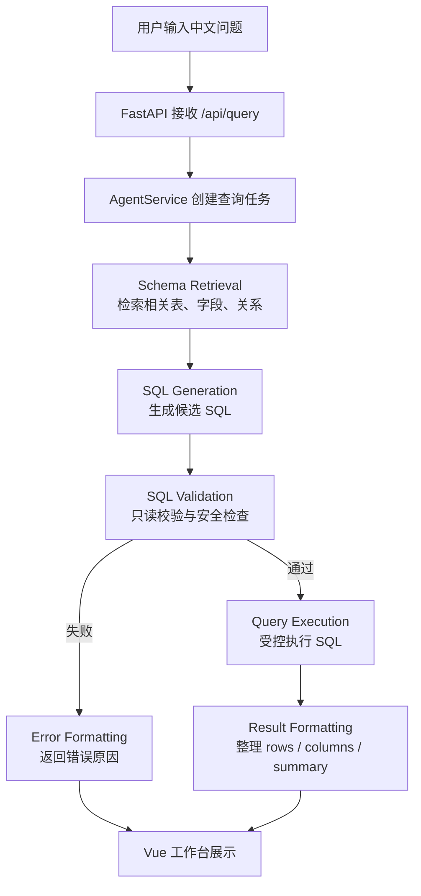

<div align="center">

# SQLAgent

### 一个面向业务场景的 NL2SQL Agent

把自然语言问题转化为可审查的 SQL、可执行的查询链路与可理解的数据结果。

<br />


<br />

[项目亮点](#-项目亮点) · [Agent 流程](#-agent-流程) · [技术栈](#-技术栈) · [快速开始](#-快速开始) · [项目结构](#-项目结构)

</div>

---

## ✨ 项目简介

**SQLAgent** 是一个正在工程化演进的 **NL2SQL Agent** 项目，目标是让用户用中文提出业务问题，系统自动完成 Schema 检索、SQL 生成、安全校验、查询执行与结果展示。

它关注的不只是“生成一段 SQL”，而是一条完整的查询链路：

> 问题输入 → Schema Grounding → SQL 生成 → 安全校验 → 受控执行 → 结果展示

当前项目适合作为企业 SQL Agent 原型、中文自然语言查数工作台、NL2SQL 工程链路验证平台继续扩展。

---

## 🚀 项目亮点

| 亮点 | 说明 |
| --- | --- |
| 中文自然语言查询 | 面向中文业务表达，输入问题即可进入 SQL 生成链路 |
| Schema Grounding | 先检索相关表、字段与关系，再交给 Agent 生成 SQL |
| LangGraph 工作流 | 用清晰节点组织检索、生成、校验、执行与格式化阶段 |
| 联表推理辅助 | 通过 relation、join hint、confidence 等信息降低盲目 JOIN 风险 |
| SQL 安全边界 | 执行前进行只读校验，拦截危险 SQL 与非预期操作 |
| 查询结果展示 | 前端展示 SQL、参数、表格数据、执行摘要与调试线索 |
| 前后端分离 | FastAPI 提供查询接口，Vue 3 提供交互式工作台 |

---

## 🧠 Agent 流程



这套流程把 NL2SQL 拆成可观察、可测试、可替换的多个阶段，方便后续增强模型调用、Schema 检索、SQL 修复、权限治理与评测回归。

---

## 🖥️ 工作台能力

前端工作台围绕“可审查的 SQL 查询体验”设计，当前可展示：

- 生成 SQL
- 查询参数
- 执行状态
- 解释说明
- 表格结果集
- 返回行数
- 执行摘要
- 错误信息
- Debug 线索

API 响应结构包含：

```text
sql
params
status
explanation
rows
columns
row_count
execution_summary
error_message
debug
```

---

## 🧩 技术栈

| 分类 | 技术 |
| --- | --- |
| 前端 | Vue 3、TypeScript、Vite |
| 后端 | Python 3.12、FastAPI、Pydantic Settings |
| Agent 编排 | LangGraph、LangChain Core |
| SQL 处理 | SQLAlchemy Async、sqlglot |
| 数据库适配 | aiosqlite、asyncmy |
| 配置与缓存 | PyYAML、Redis |
| 测试 | pytest |
| 包管理 | uv、pnpm |

---

## ⚡ 快速开始

### 1. 启动后端

```bash
cd backend
uv sync
cp .env.example .env
uv run dev.py
```

后端默认地址：

```text
http://127.0.0.1:8787
```

健康检查：

```text
http://127.0.0.1:8787/api/health
```

### 2. 启动前端

```bash
cd frontend
pnpm install
pnpm dev
```

前端默认地址：

```text
http://127.0.0.1:4242
```

前端 `/api` 请求会代理到后端 `http://127.0.0.1:8787`。

---

## 🔎 查询示例

输入问题：

```text
查询近 90 天成交额最高的前 10 个客户
```

可能生成的 SQL：

```sql
SELECT `customer_name`, SUM(`amount`) AS `total_amount`
FROM `orders`
WHERE `created_at` >= DATE_SUB(CURRENT_DATE, INTERVAL 90 DAY)
GROUP BY `customer_name`
ORDER BY `total_amount` DESC
LIMIT 10;
```

前端会进一步展示查询状态、解释说明、表格结果与执行摘要。

---

## 📁 项目结构

```text
SQLAgent/
├─ backend/
│  ├─ app/
│  │  ├─ routers/      # HTTP API 边界
│  │  ├─ services/     # 应用编排与依赖组织
│  │  ├─ agent/        # LangGraph 状态、节点与工作流
│  │  ├─ rag/          # Schema 检索与上下文构建
│  │  ├─ validator/    # SQL 安全校验
│  │  ├─ database/     # 数据库连接、执行与结果归一化
│  │  └─ prompts/      # 提示词与示例
│  ├─ tests/
│  └─ pyproject.toml
├─ frontend/
│  ├─ src/
│  ├─ package.json
│  └─ vite.config.ts
├─ docs/
└─ README.md
```

---

## 🎯 适用场景

- 企业内部自然语言查数入口
- NL2SQL Agent 原型验证
- 中文业务查询工作台
- Schema Grounding 与联表推理实验
- SQL 安全校验、执行链路与结果展示评估

---

## 🧭 当前定位

SQLAgent 当前仍处于持续演进阶段，重点是打磨一条可靠的 NL2SQL 主链路：

1. 更准确地理解业务问题
2. 更可靠地匹配数据库 Schema
3. 更安全地生成与校验 SQL
4. 更清晰地展示查询结果与调试信息

项目会优先强化真实执行、Schema 检索、跨表推理、安全边界与回归测试，而不是堆叠不必要的“多 Agent”概念。

---

## 📄 License

当前仓库未在本 README 中额外声明许可证信息；如需对外发布，请以仓库实际许可证文件为准。
